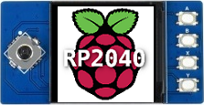

# Raspberry Pico Waveshare LCD Demo
#### Waveshare 240 x 240 LCD with Joypad + Buttons demo for Raspberry Pico

Modified version of [Raspberry Pico SDK Example](https://github.com/raspberrypi/pico-examples/tree/master/pio/st7789_lcd) for
Waveshare 1.3 Inch LCD panel [^1] with Joypad and 4 buttons.

The original demo works well with the Waveshare LCD simply by changing the pin definitions as shown.

This demo extends the original by adding functionality for the 5-way Joypad and 4 buttons on the Waveshare panel.

Panel initialisation has been simplified and modified for 90 degree LCD screen orientation.

Pico built-in LED toggles on/off every (theta_max / 12) degrees rotation.

Click on Releases > Assets for pre-built .uf2 image.

Start animation by clicking the Joypad when centred.

LCD Display Pin Numbers

  
| Function   | Original Demo Pin | Waveshare Panel Pin | 
|------------|:-----------------:| :------------------:|
| `DC`       |        3          |         8           |
| `CS`       |        2          |         9           |
| `CLK`      |        1          |         10          |
| `DIN`      |        0          |         11          |
| `RESET`    |        4          |         12          |
| `BL`       |        5          |         13          |

Joypad Pins and Functions

| Pin | Joypad     | Function              |
|:---:|------------|-----------------------|
|  2  | `UP`       |  Static Image - Up    |
| 18  | `DOWN`     |  Static Image - Down  |
| 16  | `LEFT`     |  Static Image - Left  |
| 20  | `RIGHT`    |  Static Image - Right |
|  3  | `CENTRE`   |  (Re)Start Animation  | 

Keypad Pins and Functions

| Pin | Keypad     | Function              |
|:---:|:----------:|-----------------------|
| 15  | `A`        | Speed up / slow down  |
| 17  | `B`        | Slow down / speed up  |
| 19  | `X`        | Stop Animation        |
| 21  | `Y`        | Animation Direction   |

[^1]:https://www.waveshare.com/wiki/Pico-LCD-1.3

